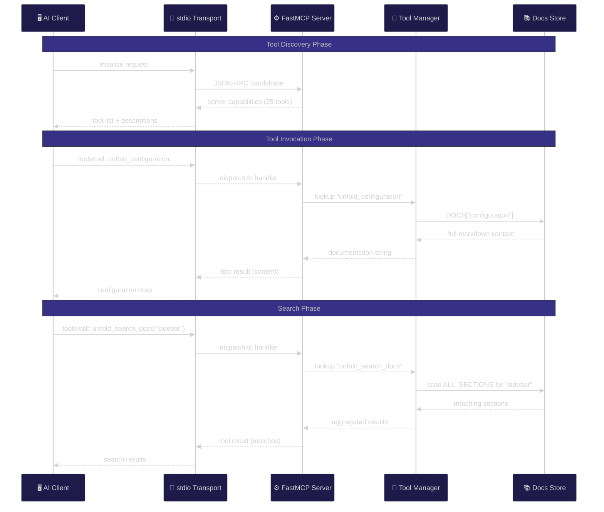
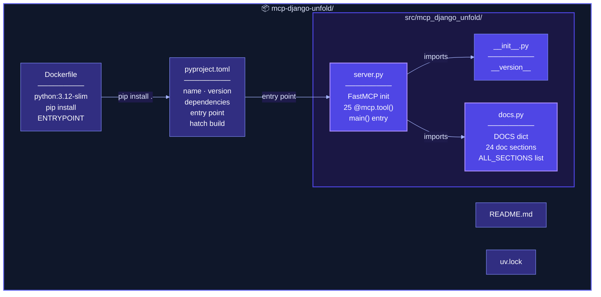
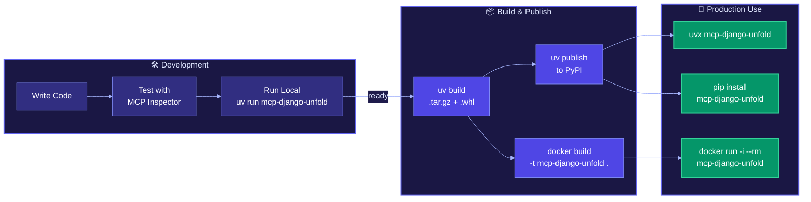

<p align="center">
  
  
  
  
</p>

# 🔮 MCP Django Unfold

> **A Model Context Protocol (MCP) server that gives AI agents complete, accurate knowledge of the [Django Unfold](https://unfoldadmin.com) admin theme — so they can implement it without hallucination.**

Built with the [MCP Python SDK](https://github.com/modelcontextprotocol/python-sdk) (FastMCP), this server exposes **25 documentation tools** covering every feature, configuration option, and third-party integration of Django Unfold. Compatible with Claude Desktop, VS Code GitHub Copilot, Cursor, and any MCP-compatible client.

---

## 📑 Table of Contents

- [Why This Exists](#-why-this-exists)
- [Architecture](#-architecture)
- [Project Structure](#-project-structure)
- [Quick Start](#-quick-start)
- [Client Configuration](#-client-configuration)
- [Available Tools](#-available-tools)
- [How It Was Built](#-how-it-was-built)
- [Development Guide](#-development-guide)
- [Production Deployment](#-production-deployment)
- [Dev → Prod Pipeline](#-dev--prod-pipeline)
- [Contributing](#-contributing)
- [License](#-license)

---

## 💡 Why This Exists

AI coding agents (Claude, Copilot, Cursor) frequently hallucinate when generating Django Unfold code — inventing non-existent settings, using wrong import paths, or missing critical ordering requirements in `INSTALLED_APPS`. This MCP server solves that by providing:

- **Verified documentation** — every code example is sourced directly from the official Django Unfold docs
- **Complete coverage** — 24 documentation sections spanning installation to advanced integrations
- **Instant access** — AI agents call tools and get authoritative answers in milliseconds
- **Search** — full-text search across all documentation sections

---

## 🏗️ Architecture

### System Overview

```mermaid
%%{init: {'theme': 'dark', 'themeVariables': {'primaryColor': '#6366f1', 'primaryTextColor': '#ffffff', 'primaryBorderColor': '#818cf8', 'lineColor': '#a5b4fc', 'secondaryColor': '#1e1b4b', 'tertiaryColor': '#312e81', 'background': '#0f0d1a', 'mainBkg': '#1e1b4b', 'nodeBorder': '#818cf8', 'clusterBkg': '#1a1744', 'clusterBorder': '#4f46e5', 'titleColor': '#ffffff', 'edgeLabelBackground': '#1e1b4b', 'textColor': '#e0e7ff', 'noteTextColor': '#ffffff', 'noteBkgColor': '#312e81'}}}%%
flowchart TB
    subgraph clients["🖥️ MCP Clients"]
        direction LR
        claude["Claude Desktop"]
        vscode["VS Code Copilot"]
        cursor["Cursor / Other IDE"]
        custom["Custom MCP Client"]
    end

    subgraph transport["📡 Transport Layer"]
        stdio["stdio (stdin/stdout)"]
    end

    subgraph server["⚙️ MCP Server — mcp-django-unfold"]
        direction TB
        fastmcp["FastMCP Runtime\n(mcp Python SDK)"]
        
        subgraph tools["🔧 25 Documentation Tools"]
            direction LR
            core["Core Tools\n─────────\nunfold_get_started\nunfold_configuration\nunfold_actions\nunfold_filters\nunfold_decorators"]
            ui["UI Tools\n─────────\nunfold_components\nunfold_inlines\nunfold_widgets\nunfold_tabs\nunfold_dashboard"]
            adv["Advanced Tools\n─────────\nunfold_pages\nunfold_styles_scripts\nunfold_features_overview\nunfold_complete_example\nunfold_search_docs"]
            integ["Integration Tools\n─────────\nimport_export\nguardian\nsimple_history\ncelery_beat\nmodeltranslation\nmoney · constance\nlocation · djangoql\njson_widget"]
        end

        subgraph docs["📚 Documentation Store"]
            docsmod["docs.py\n─────────\nDOCS dict\n24 sections\nFull code examples"]
        end
    end

    clients -->|"JSON-RPC over stdio"| transport
    transport --> fastmcp
    fastmcp --> tools
    tools --> docs

    style clients fill:#1e1b4b,stroke:#6366f1,stroke-width:2px,color:#e0e7ff
    style transport fill:#312e81,stroke:#818cf8,stroke-width:2px,color:#e0e7ff
    style server fill:#0f172a,stroke:#6366f1,stroke-width:2px,color:#e0e7ff
    style tools fill:#1a1744,stroke:#4f46e5,stroke-width:1px,color:#e0e7ff
    style docs fill:#1a1744,stroke:#4f46e5,stroke-width:1px,color:#e0e7ff
    style claude fill:#312e81,stroke:#818cf8,color:#ffffff
    style vscode fill:#312e81,stroke:#818cf8,color:#ffffff
    style cursor fill:#312e81,stroke:#818cf8,color:#ffffff
    style custom fill:#312e81,stroke:#818cf8,color:#ffffff
    style stdio fill:#312e81,stroke:#818cf8,color:#ffffff
    style fastmcp fill:#4f46e5,stroke:#818cf8,color:#ffffff
    style core fill:#312e81,stroke:#6366f1,color:#e0e7ff
    style ui fill:#312e81,stroke:#6366f1,color:#e0e7ff
    style adv fill:#312e81,stroke:#6366f1,color:#e0e7ff
    style integ fill:#312e81,stroke:#6366f1,color:#e0e7ff
    style docsmod fill:#312e81,stroke:#6366f1,color:#e0e7ff
```



### Request Flow



---

## 📂 Project Structure



```
mcp-django-unfold/
├── pyproject.toml              # Package metadata, dependencies, build config
├── Dockerfile                  # Container image for production
├── .dockerignore               # Docker build exclusions
├── .gitignore                  # Git exclusions
├── README.md                   # This file
├── LICENSE                     # MIT license
├── uv.lock                     # Dependency lock file
└── src/
    └── mcp_django_unfold/
        ├── __init__.py         # Package init + version
        ├── server.py           # FastMCP server + 25 tool definitions
        └── docs.py             # Complete documentation content (24 sections)
```

| File | Purpose |
|------|---------|
| `server.py` | FastMCP server initialization, all 25 `@mcp.tool()` handlers, and `main()` entry point |
| `docs.py` | `DOCS` dictionary containing 24 full documentation sections with code examples |
| `pyproject.toml` | Package name, version, Python ≥3.11, `mcp[cli]` dependency, hatchling build |
| `Dockerfile` | Production-ready container using `python:3.12-slim` |

---

## 🚀 Quick Start

### Option 1: uvx (recommended — zero install)

```bash
uvx mcp-django-unfold
```

### Option 2: pip install

```bash
pip install mcp-django-unfold
mcp-django-unfold
```

### Option 3: Docker

```bash
docker build -t mcp-django-unfold .
docker run -i --rm mcp-django-unfold
```

---

## ⚙️ Client Configuration

### Claude Desktop

Add to `~/Library/Application Support/Claude/claude_desktop_config.json` (macOS) or `%APPDATA%\Claude\claude_desktop_config.json` (Windows):

```json
{
  "mcpServers": {
    "django-unfold": {
      "command": "uvx",
      "args": ["mcp-django-unfold"]
    }
  }
}
```

### VS Code (GitHub Copilot)

Add to your project's `.vscode/mcp.json`:

```json
{
  "servers": {
    "django-unfold": {
      "command": "uvx",
      "args": ["mcp-django-unfold"]
    }
  }
}
```

### Cursor

Add to `~/.cursor/mcp.json`:

```json
{
  "mcpServers": {
    "django-unfold": {
      "command": "uvx",
      "args": ["mcp-django-unfold"]
    }
  }
}
```

### Docker-based Configuration

For any client that supports Docker:

```json
{
  "mcpServers": {
    "django-unfold": {
      "command": "docker",
      "args": ["run", "-i", "--rm", "mcp-django-unfold"]
    }
  }
}
```

---

## 🔧 Available Tools

### Core Documentation

| Tool | Description |
|------|-------------|
| `unfold_get_started` | Installation, INSTALLED_APPS ordering, ModelAdmin setup |
| `unfold_configuration` | Complete `UNFOLD` settings dict — every option with examples |
| `unfold_actions` | Global, row, detail & submit line actions with icons/variants |
| `unfold_filters` | Dropdown, numeric, date, text, autocomplete filters |
| `unfold_decorators` | `@display` decorator — labels, headers, dropdowns |

### UI & Layout

| Tool | Description |
|------|-------------|
| `unfold_components` | Dashboard components — card, chart, button, table, progress... |
| `unfold_inlines` | Stacked, tabular, nonrelated & sortable inlines |
| `unfold_widgets` | Form widgets — ArrayWidget, switches, WYSIWYG, all input types |
| `unfold_tabs` | Changelist tab navigation |
| `unfold_dashboard` | Custom dashboard with DASHBOARD_CALLBACK |
| `unfold_pages` | Custom admin pages with class-based views |
| `unfold_styles_scripts` | Custom CSS/JS, Tailwind 3.x & 4.x setup |

### Third-party Integrations

| Tool | Description |
|------|-------------|
| `unfold_integration_import_export` | django-import-export forms and admin setup |
| `unfold_integration_guardian` | django-guardian object-level permissions |
| `unfold_integration_simple_history` | django-simple-history model tracking |
| `unfold_integration_celery_beat` | django-celery-beat task scheduling admin |
| `unfold_integration_modeltranslation` | django-modeltranslation with language flags |
| `unfold_integration_money` | django-money (auto-styled) |
| `unfold_integration_constance` | django-constance dynamic settings |
| `unfold_integration_location_field` | django-location-field map widget |
| `unfold_integration_djangoql` | djangoql advanced search (auto-styled) |
| `unfold_integration_json_widget` | django-json-widget (auto-styled) |

### Meta

| Tool | Description |
|------|-------------|
| `unfold_features_overview` | Complete feature list and technology stack |
| `unfold_complete_example` | Full working project — settings, models, admin, templates |
| `unfold_search_docs` | Full-text search across all 24 documentation sections |

---

## 🧱 How It Was Built

### Technology Stack

| Layer | Technology | Purpose |
|-------|-----------|---------|
| **Protocol** | [Model Context Protocol](https://modelcontextprotocol.io) | Standardized AI ↔ tool communication |
| **SDK** | [mcp Python SDK](https://github.com/modelcontextprotocol/python-sdk) (FastMCP) | Server framework with `@mcp.tool()` decorator pattern |
| **Transport** | stdio (stdin/stdout) | Local process communication — fast, no network overhead |
| **Build** | [Hatchling](https://hatch.pypa.io) | Modern Python build backend |
| **Runtime** | Python ≥ 3.11 | Type hints, modern syntax |
| **Package** | [uvx](https://docs.astral.sh/uv/) / pip | Zero-install execution via uvx |
| **Container** | Docker (`python:3.12-slim`) | Production-ready deployment |

### Design Decisions

1. **Embedded documentation** — All docs are stored as Python strings in `docs.py` rather than fetched at runtime. This ensures zero latency, offline operation, and version-locked accuracy.

2. **One tool per topic** — Each documentation section gets its own MCP tool with a descriptive docstring. AI agents can discover and call exactly the tool they need.

3. **Full-text search** — The `unfold_search_docs` tool scans all sections by keyword, so agents can find relevant docs even when they don't know the exact tool name.

4. **stdio transport** — Chosen for local-first usage. The server starts as a child process of the AI client — no ports, no network config, no auth needed.

5. **src layout** — Standard Python packaging layout (`src/mcp_django_unfold/`) with hatchling build for clean wheel generation and PyPI publishing.

---

## 🛠️ Development Guide

### Prerequisites

- Python 3.11+
- [uv](https://docs.astral.sh/uv/) (recommended) or pip

### Setup

```bash
# Clone the repository
git clone https://github.com/rissets/mcp-django-unfold.git
cd mcp-django-unfold

# Install dependencies in a virtual environment
uv sync
```

### Run Locally

```bash
# Run the server directly
uv run mcp-django-unfold
```

### Test with MCP Inspector

The [MCP Inspector](https://github.com/modelcontextprotocol/inspector) lets you interactively browse and call tools:

```bash
npx @modelcontextprotocol/inspector uv run mcp-django-unfold
```

This opens a web UI where you can:
- See all 25 registered tools
- Read each tool's description and parameters
- Execute tools and inspect the returned documentation

### Verify the Server

```bash
# Quick smoke test — check tools load
uv run python -c "
from mcp_django_unfold.server import mcp
print(f'Server: {mcp.name}')
print(f'Tools:  {len(mcp._tool_manager._tools)}')
"
# Expected output:
# Server: django_unfold_mcp
# Tools:  25
```

### Adding Documentation

1. Add a new section to the `DOCS` dictionary in `src/mcp_django_unfold/docs.py`
2. Create a corresponding `@mcp.tool()` function in `src/mcp_django_unfold/server.py`
3. The search tool (`unfold_search_docs`) will automatically index the new section

### Code Style

```bash
# Format
uv run ruff format src/

# Lint
uv run ruff check src/
```

---

## 🚢 Production Deployment

### Publish to PyPI

```bash
# Build the package
uv build
# This creates dist/mcp_django_unfold-0.1.0.tar.gz and .whl

# Upload to PyPI
uv publish
# Or with twine:
# twine upload dist/*
```

Once published, anyone can run it instantly:

```bash
uvx mcp-django-unfold
```

### Docker

```bash
# Build
docker build -t mcp-django-unfold .

# Run (interactive mode required for stdio)
docker run -i --rm mcp-django-unfold

# Tag and push to a registry
docker tag mcp-django-unfold ghcr.io/rissets/mcp-django-unfold:latest
docker push ghcr.io/rissets/mcp-django-unfold:latest
```

### Version Bump Workflow

1. Update `version` in `pyproject.toml`
2. Update `__version__` in `src/mcp_django_unfold/__init__.py`
3. Commit, tag, and push:

```bash
git add -A
git commit -m "release: v0.2.0"
git tag v0.2.0
git push origin main --tags
```

4. Build and publish:

```bash
uv build && uv publish
```

---

## 🔄 Dev → Prod Pipeline



| Stage | Command | What Happens |
|-------|---------|--------------|
| **Dev** | `uv sync` | Install deps locally in `.venv` |
| **Dev** | `uv run mcp-django-unfold` | Run server for local testing |
| **Dev** | `npx @modelcontextprotocol/inspector ...` | Interactive tool browser |
| **Build** | `uv build` | Generate `.tar.gz` + `.whl` in `dist/` |
| **Publish** | `uv publish` | Upload to PyPI |
| **Prod** | `uvx mcp-django-unfold` | Zero-install run from PyPI |
| **Prod** | `docker run -i --rm mcp-django-unfold` | Containerized run |

---

## 🤝 Contributing

1. Fork the repository
2. Create a feature branch: `git checkout -b feat/new-docs-section`
3. Make your changes to `docs.py` and `server.py`
4. Test with MCP Inspector
5. Submit a pull request

---

## 📄 License

MIT — see [LICENSE](LICENSE) for details.

---

<p align="center">
  Built with ❤️ for the Django Unfold community<br/>
  <a href="https://unfoldadmin.com">Django Unfold</a> · <a href="https://modelcontextprotocol.io">Model Context Protocol</a> · <a href="https://github.com/modelcontextprotocol/python-sdk">MCP Python SDK</a>
</p>
